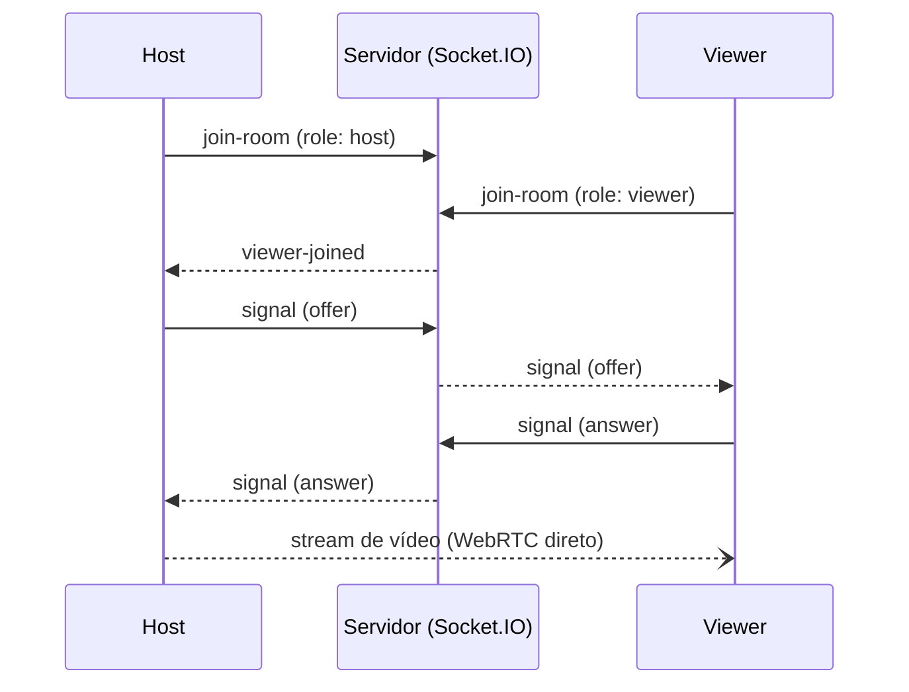

# 📡 DoomTransmit

Compartilhamento de tela em tempo real, direto do navegador, via **WebRTC**.
Sem instalar nada: quem transmite gera um link, quem assiste só abre o link.

## ✨ Como funciona

1. O **host** acessa a página inicial e clica em "Iniciar compartilhamento".
2. É criada uma sala (`room`) com um ID único e o navegador pede a tela/janela para compartilhar.
3. O host recebe um link (`/view.html?room=...`) para enviar a quem for assistir.
4. Cada **viewer** que abrir o link entra na sala e recebe o vídeo direto do host via WebRTC (peer-to-peer), sem transcodificar nada no servidor.

O servidor Node.js só cuida da parte de **sinalização** (WebSocket, via Socket.IO): apresentar host e viewers uns aos outros para que a conexão WebRTC seja estabelecida. O vídeo em si nunca passa pelo servidor.



## 🧱 Stack

- **[Node.js](https://nodejs.org/) + [Express](https://expressjs.com/)** — servidor HTTP e arquivos estáticos.
- **[Socket.IO](https://socket.io/)** — sinalização em tempo real entre host e viewers.
- **WebRTC (`getDisplayMedia`)** — captura e transmissão de tela nativas do navegador.
- **HTML/CSS/JS puro** no front-end, sem build step.
- **Docker + Caddy** — deploy com HTTPS automático (Let's Encrypt) atrás de um reverse proxy.

## 📁 Estrutura do projeto

```
server.js          # servidor Express + Socket.IO (sinalização e gerência de salas)
public/
  index.html        # tela inicial, cria a sala
  host.html / host.js   # tela do transmissor (captura e envia a tela)
  view.html / view.js   # tela do espectador (recebe e exibe o vídeo)
  style.css
Dockerfile          # imagem da aplicação Node
docker-compose.yml  # app + Caddy (reverse proxy/HTTPS)
Caddyfile           # configuração do Caddy
```

## 🚀 Rodando localmente

Requer [Node.js](https://nodejs.org/) 18+.

```bash
npm install
npm start
```

Acesse `http://localhost:3000`. WebRTC funciona em `localhost` sem HTTPS, mas em outra rede o navegador exige uma origem segura (por isso o deploy usa Caddy com HTTPS).

## 🐳 Deploy com Docker

Pré-requisitos no servidor:

- **Domínio próprio** apontando para o IP do servidor (registro DNS tipo A) — necessário para o Caddy emitir certificado HTTPS válido via Let's Encrypt.
- **Docker** e **Docker Compose**.
- Portas **80** e **443** liberadas no firewall.

1. Copie `.env.example` para `.env` e preencha:

   ```bash
   cp .env.example .env
   nano .env
   ```

   ```env
   DOMAIN=seu-dominio-aqui.com
   EMAIL=seu-email@exemplo.com
   ```

2. Suba os containers:

   ```bash
   docker compose up -d --build
   ```

O app fica disponível em `https://SEU_DOMINIO`. O Caddy cuida do certificado TLS automaticamente e faz proxy reverso para o container Node na porta `3000`.

### Variáveis de ambiente

| Variável | Descrição                                                        | Onde é usada                      |
| -------- | ---------------------------------------------------------------- | --------------------------------- |
| `DOMAIN` | Domínio público usado pelo Caddy para emitir o certificado HTTPS | `docker-compose.yml`, `Caddyfile` |
| `EMAIL`  | E-mail para registro no Let's Encrypt                            | `docker-compose.yml`, `Caddyfile` |
| `PORT`   | Porta interna do servidor Node (padrão `3000`)                   | `server.js`, `docker-compose.yml` |

## ⚙️ Adaptando para outro ambiente

Alguns ajustes comuns caso o cenário de deploy seja diferente do padrão (domínio público + portas 80/443 livres):

- **Portas 80/443 já ocupadas** (ex.: outro reverse proxy na máquina): troque em `docker-compose.yml`, no serviço `caddy`, o mapeamento de portas, por exemplo `"8082:80"` e `"8444:443"`.
- **Sem domínio público / acesso só por IP**: use `DOMAIN=localhost` no `.env` — o Caddy emite um certificado interno autoassinado. Nesse caso, adicione `default_sni {$DOMAIN}` no bloco global do `Caddyfile` (alguns clientes não enviam SNI ao acessar direto por IP, e sem essa diretiva o handshake TLS falha com `internal error`), e inclua o IP do servidor junto do domínio no bloco de site: `{$DOMAIN}, 192.168.0.100 { ... }`.
- **Integração com Cloudflare Tunnel**: conecte o serviço `app` a uma rede Docker externa onde o `cloudflared` também esteja, para o túnel alcançar o app diretamente (sem passar pelo Caddy):

  ```yaml
  services:
    app:
      networks:
        - default
        - tunnel

  networks:
    tunnel:
      external: true
  ```

  A rede `tunnel` precisa existir antes (normalmente já é criada pelo próprio `cloudflared`); se não existir, crie com `docker network create tunnel`. Depois, configure o public hostname no painel Cloudflare Zero Trust apontando para `http://doomtransmit-app:3000`.
